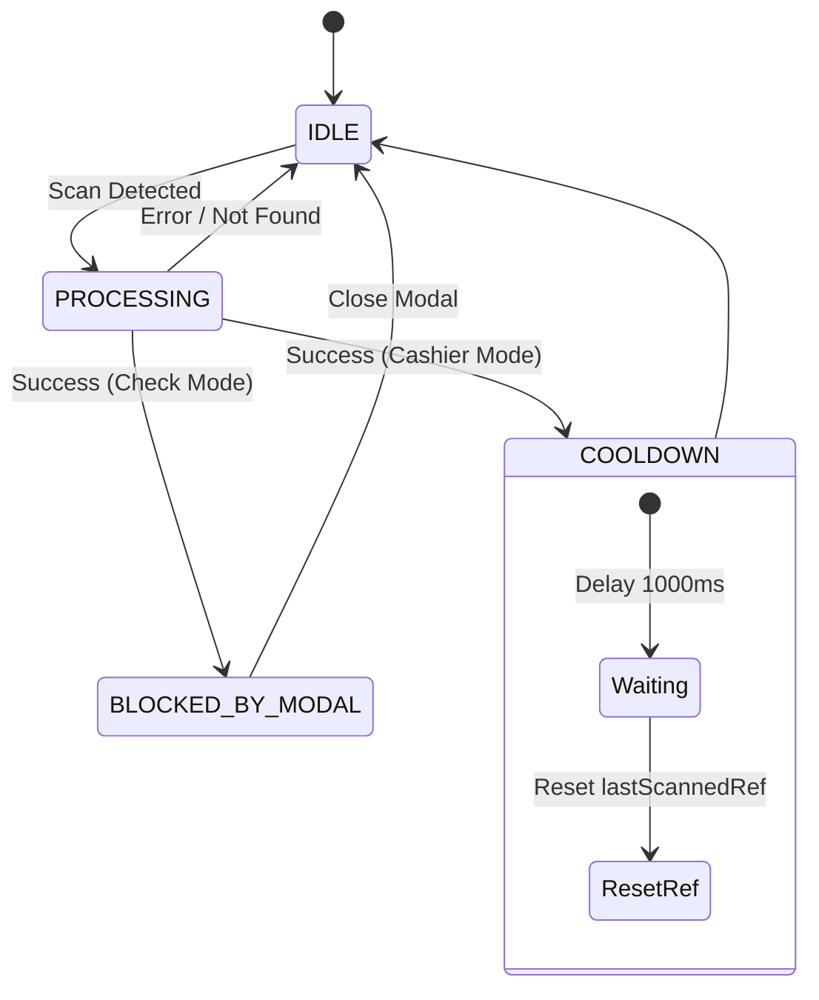

# Data Flow

## 1. Overview

The data flow within the Sentosa ATK application is entirely event-driven. It is triggered by user interactions on the mobile client (such as barcode scanning or button presses), processed locally via React Context states, and committed to Firebase Firestore through a combination of isolated transactions and real-time listeners.

## 2. Core Flows

### 2.1 Read Flows

#### **Scan Product (Cashier/Check Mode)**

1. The built-in device camera captures a barcode using the Expo module.
2. The application extracts the barcode string value.
3. The client queries the Firestore `products` collection filtering by the `barcode` or `sku` field.
4. The Scanner State Machine shifts according to the lookup result:
   - If the product is found and the application is in **Cashier Mode**: The item is automatically injected into the cart context, and the state switches to `COOLDOWN` for 1000ms to block accidental duplicate reads before returning to `IDLE`.
   - If the product is found and the application is in **Check Mode**: A detail modal renders over the UI, locking the machine state in `BLOCKED_BY_MODAL` until the user dismisses it.
   - If the product is not found: An error prompt fires, and the state reverts to `IDLE`.

#### **Search Product (Prefix Search)**

1. The user types a query string into the `SearchProduct` input field.
2. The application normalizes the input text into a lowercase string.
3. The client executes a range query against Firestore:
   - `startAt(input_lowercase)`
   - `endAt(input_lowercase + '\uf8ff')`
4. Firestore streams back up to 10 matching documents sorted alphabetically (`ascending`) against the indexed `name_lowercase` field.

---

### 2.2 Write Flows

#### **Checkout Transaction (handleCheckout)**

1. The user taps the **"Checkout"** button on the `CashierScreen`.
2. The screen pulls the active items array from `CartContext`.
3. The system fires a `Promise.all()` wrapper to initiate parallel stock operations.
4. For every individual item in the cart, `updateProductStock(barcode, qty)` executes:
   - Opens an isolated `db.runTransaction`.
   - Reads the latest snapshot of the product document to capture the current `stock` and `price_sell`.
   - Deducts the checkout `qty` from the database `stock`.
   - Computes the asset depreciation: `valueReduction = price_sell * qty`.
   - Writes the updated stock value back into the product document.
   - Decrements the `total_asset_value` counter inside the `metadata/global` document by `valueReduction`.
5. If `Promise.all()` resolves smoothly without throws: The UI throws a success toast and calls `clearCart()` to purge the volatile local state.

#### **Restock Transaction (restockProduct)**

1. The user sets up the replenishment quantities and hits **"Restock"** on the `RestockScreen`.
2. The screen maps over the dataset, launching parallel hooks via `Promise.all()` to trigger `restockProduct(barcode, qty)`.
3. Inside each distinct atomic transaction closure (`db.runTransaction`):
   - Reads the current product snapshot to grab its `stock` and `price_sell` constants.
   - Computes the incremented inventory level: `new_stock = current_stock + qty`.
   - Computes the incoming asset growth: `valueAddition = price_sell * qty`.
   - Saves the updated stock value back into the document block.
   - Increments the `total_asset_value` entry in the `metadata/global` document by `valueAddition`.

#### **Add / Update Product (saveProduct)**

1. The user modifies or writes a product form entry on the `InventoryScreen` and hits save.
2. The application triggers `saveProduct(barcode, data)`.
3. Opens a standard `db.runTransaction`:
   - Fetches the historical product document (if it exists) to compute asset fluctuations.
   - Computes the previous asset value: `old_value = old_stock * old_price_sell`.
   - Computes the new intended asset value: `new_value = new_stock * new_price_sell`.
   - Measures the delta shift: `diff = new_value - old_value`.
   - Saves the clean product payload, automatically hooks a freshly compiled `name_lowercase` index string, and attaches a server-side `updatedAt` timestamp metadata.
   - Updates the centralized `total_asset_value` tracker inside the metadata collection by adding the calculated `diff`.

---

### 2.3 Scanner State Machine

The `stateRef` mutable variable acts as a gatekeeper to orchestrate camera stream capture cycles and safeguard the application from telemetry race conditions:

## 3. Data Consistency Guarantees

- **Local Transaction Integrity** 
      
   Every granular mutation targeting a single product identity (adding a record, restocking an item, or modifying inventory counts) is strongly protected under full ACID conditions via `db.runTransaction`. The coupling between an individual product document adjustment and the global `total_asset_value` tracker is guaranteed to execute atomically.

- **No Global Bulk Invariant** 
   
   There is no global, overarching transaction boundary wrapping the entire basket during checkouts. Because the process is divided among concurrent `Promise.all()` tasks, a critical mid-process failure could result in a *partially updated* database state, where some inventory records are successfully processed while others remain untouched.